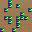
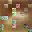
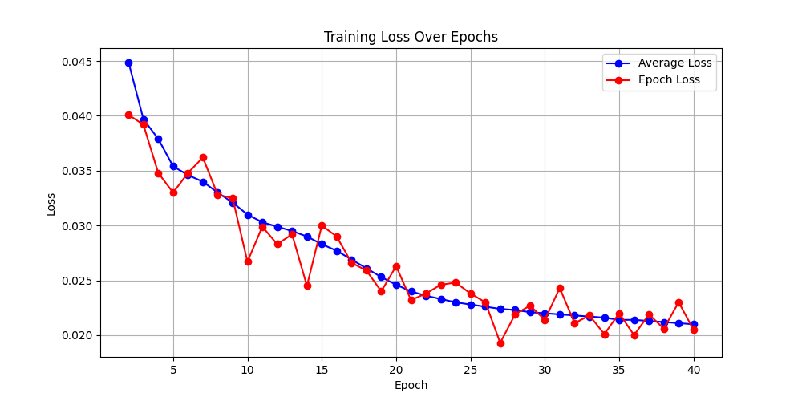

# Masked Autoencoder for CIFAR-10

## 🚀 Project Overview

This project implements a **Masked Autoencoder (MAE)** using **PyTorch**, specifically adapted for small image sizes like **32x32** (CIFAR-10). The MAE learns to reconstruct randomly masked image patches, which can be used for self-supervised learning or feature extraction.

## 🏆 Results

Reconstructed images at different epochs:

| Ground Truth                         | Epoch 1                                                   | Epoch 10                                                   | Epoch 39                                                   |
| ------------------------------------ | --------------------------------------------------------- | ---------------------------------------------------------- | ---------------------------------------------------------- |
|  |  |  |  |

The model progressively improves its ability to reconstruct missing patches as training continues.

---

## 📉 Training Loss



---

## 🔮 Future Steps

Do more epochs

<details>
<summary>Additional Information</summary>

### 🔧 Features

- **MAE Architecture**: Encoder-decoder transformer model.
- **Custom Dataset & Dataloader**: Handles CIFAR-10 images.
- **Random Masking**: Selects patches for masking dynamically.
- **Training & Checkpointing**: Supports resuming training from saved checkpoints.
- **Inference Pipeline**: Reconstructs masked images.
- **Visualization Tool**: Extracts and saves sample images from CIFAR-10.

---

## 📂 Repository Structure

```
masked-auto-encoder/
│── mae.py                      # MAE model implementation & training loop
│── inference.py                 # Inference script for reconstruction
│── cifar_10_image_visualizer.py  # Extracts images from CIFAR-10 dataset
│── chat_context.py               # Script to log project structure
│── .gitignore                    # Ignores dataset files and model checkpoints
│── README.md                     # This file
│── data/
│   ├── img.png                   # Sample CIFAR-10 image
│   ├── img_reconstructed_epoch1.png   # MAE output after 1 epoch
│   ├── img_reconstructed_epoch10.png  # MAE output after 10 epochs
│   ├── img_reconstructed_epoch39.png  # MAE output after 39 epochs
│── cifar-10-batches-py/          # CIFAR-10 dataset (binary format)
│── mae_checkpoint.pth            # Latest model checkpoint
│── mae_checkpoint_10epoch.pth    # Checkpoint at epoch 10
│── mae_checkpoint_39epoch.pth    # Checkpoint at epoch 39
│── .git/                         # Git repository metadata
```

---

## 📦 Installation

1. **Clone the repository:**

   ```bash
   git clone https://github.com/tario-you/masked-auto-encoder.git
   cd masked-auto-encoder
   ```

2. **Install dependencies:**

   ```bash
   pip install torch torchvision numpy tqdm matplotlib pillow
   ```

3. **Download the CIFAR-10 dataset:**
   - The dataset should be placed in `cifar-10-batches-py/`
   - If not already available, download it from: [CIFAR-10 Dataset](https://www.cs.toronto.edu/~kriz/cifar.html)

---

## 🏋️‍♂️ Training the Model

To train the **Masked Autoencoder** from scratch:

```bash
python mae.py
```

- **Training Details:**
  - Uses **AdamW optimizer** with a **learning rate of 1e-4**.
  - Randomly **masks 75% of image patches** before feeding into the encoder.
  - Training progress is logged using **tqdm**.

**Resume from a checkpoint** (if a checkpoint exists):

```bash
python mae.py  # Automatically loads from mae_checkpoint.pth
```

---

## 🔍 Running Inference

To run inference on a sample CIFAR-10 image:

```bash
python inference.py
```

- This script reconstructs a masked image using the trained **MAE model**.
- Output images are saved in the `data/` directory.

---

## 📊 Visualizing CIFAR-10 Images

To extract and save a sample image from the CIFAR-10 dataset:

```bash
python cifar_10_image_visualizer.py
```

- Saves an image as `data/img.png`, which is later used for inference.

---

## 📝 Model Checkpoints

- `mae_checkpoint.pth`: Latest trained model checkpoint.
- `mae_checkpoint_10epoch.pth`: Model checkpoint after 10 epochs.
- `mae_checkpoint_39epoch.pth`: Model checkpoint after 39 epochs.

These allow resuming training or running inference with different trained models.

---

## 🔧 Future Work

- Implement **fine-tuning** for downstream tasks.
- Experiment with **different masking strategies**.
- Evaluate performance on **other datasets**.

---

## 👤 Author

- **Tario You** ([GitHub](https://github.com/tario-you))

---

## 🔗 References

- **Masked Autoencoders Are Scalable Vision Learners** (He et al., 2021)
- [CIFAR-10 Dataset](https://www.cs.toronto.edu/~kriz/cifar.html)

---

## 🏁 Conclusion

This project demonstrates a working implementation of a **Masked Autoencoder** for **CIFAR-10**, showcasing self-supervised learning through patch-based image reconstruction. 🚀

</details>
